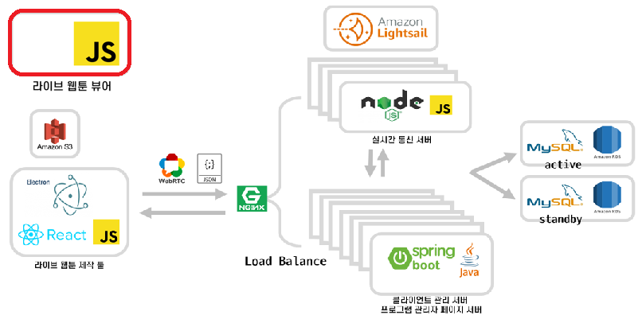

# Sotact-Viewer

## Introduction

>클라이언트를 통해 제작된 데이터를 실제로 보여주는 뷰어 라이브러리 입니다.  
>뷰어를 라이브러리화 하여 제공함으로써 타 플랫폼이나 일반 사용자가 쉽게 사용할 수 있습니다.  
>현재는 스크롤 단위 애니메이션만 구현되어 있지만, 시간 단위 애니메이션이 추가될 예정입니다.  
>웹툰 뿐만 아니라 html5와 javascript를 지원하는 모든 환경에서 사용할 수 있습니다.  
>현재 목표는 시간 단위 애니메이션 추가와 아직 구현만 하고 적용되지 않은 효과들을 추가하는 것입니다.  
>ex) Composite Operation, Filter, Transform  

### Architecture

---




### Dependency

---
| 라이브러리 | 버전 |
|---|:---:|
| `Konva` | 7.0.3 or higher |
| `lz-string` | 1.4.4 |
>Konva는 7.0.3 을 사용하였습니다. 
>lz-string은 1.4.4 가 최종버전입니다. 


### Installation

---

${~}는 사용자 지정 경로 또는 값 입니다.
```html
<!-- Dependency -->
<script src="https://unpkg.com/konva@7.0.3/konva.min.js"></script>
<script src="https://unpkg.com/lz-string@1.4.4/libs/lz-string.min.js"></script>

<!-- Core -->
<script src="${LIB_PATH}/util.js"></script>
<script src="${LIB_PATH}/data-parser.js"></script>
<script src="${LIB_PATH}/taw.js"></script>

<!-- Additional (smooth scroll) -->
<script src="${LIB_PATH}/smoothscroll.js"></script>
```


### Usage

---

${~}는 사용자 지정 경로 또는 값 입니다.  

**Template**
```html
<script>
    const cuts = ['${CUT_NAME}', ...];

    // content container query selector
    TAW.container('${QUERY}');
    // ${IMAGE_DATA_PATH}/${CUT_NAME}  default : /
    TAW.baseUrl('${IMAGE_DATA_PATH}/');
    // ${JSON_DATA_PATH}/${CUT_NAME}  default : /
    parser.baseUrl('${JSON_DATA_PATH}/');
    TAW.loadCuts(cuts);
</script>
```
**Cuts Loaded Event**
```html
<script>
    TAW.loadCuts(cuts).then(() => {
        // do something
    })
</script>
```


### Demo
---
실행을 위해 레포지토리 클론
```
git clone https://git.swmgit.org/swmaestro/sotact-viewer.git
```
사용 환경별 실행 방법  

| Env / Module | Command |
|:---:|---|
| **Node JS** http-server module | http-server -p 80|
| **Python 2.x** SimpleHTTPServer module | python -m SimpleHTTPServer 80 |
| **Python 3.x** http.server module | python -m http.server 80 |
| other http server | ~ |


### Sotact-FrontEnd Contributors

---

박석환 : master@esllo.com
