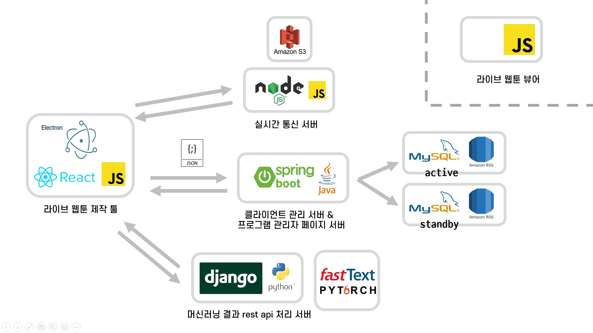

# Sotact-Viewer

## Introduction

>클라이언트를 통해 제작된 데이터를 실제로 보여주는 뷰어 라이브러리 입니다.  
>뷰어를 라이브러리화 하여 제공함으로써 타 플랫폼이나 일반 사용자가 쉽게 사용할 수 있습니다.  
>현재는 스크롤 단위 애니메이션만 구현되어 있지만, 시간 단위 애니메이션이 추가될 예정입니다.  
>웹툰 뿐만 아니라 html5와 javascript를 지원하는 모든 환경에서 사용할 수 있습니다.  
>현재 목표는 시간 단위 애니메이션 추가와 아직 구현만 하고 적용되지 않은 효과들을 추가하는 것입니다.  
>ex) Composite Operation, Filter, Transform  

## Architecture




## Dependency
| 라이브러리 | 버전 |
|---|:---:|
| `Konva` | 7.0.3 or higher |
| `lz-string` | 1.4.4 |
>Konva는 7.0.3 을 사용하였습니다. 
>lz-string은 1.4.4 가 최종버전입니다. 


## Installation

${~}는 사용자 지정 경로 또는 값 입니다.
```html
<!-- Dependency -->
<script src="https://unpkg.com/konva@7.0.3/konva.min.js"></script>
<script src="https://unpkg.com/lz-string@1.4.4/libs/lz-string.min.js"></script>

<!-- Core -->
<script src="${LIB_PATH}/util.js"></script>
<script src="${LIB_PATH}/data-parser.js"></script>
<script src="${LIB_PATH}/taw.js"></script>

<!-- Additional (smooth scroll) -->
<script src="${LIB_PATH}/smoothscroll.js"></script>
```


## Usage
${~}는 사용자 지정 경로 또는 값 입니다.  

### Template
```html
<script>
    const cuts = ['${CUT_NAME}', ...];

    // content container query selector
    TAW.container('${QUERY}');
    // ${IMAGE_DATA_PATH}/${CUT_NAME}  default : /
    TAW.baseUrl('${IMAGE_DATA_PATH}/');
    // ${JSON_DATA_PATH}/${CUT_NAME}  default : /
    parser.baseUrl('${JSON_DATA_PATH}/');
    TAW.loadCuts(cuts);
</script>
```
### Cuts Loaded Event
```html
<script>
    TAW.loadCuts(cuts).then(() => {
        // do something
    })
</script>
```


## Demo
실행을 위해 레포지토리 클론
```bash
# git clone
git clone https://git.swmgit.org/swmaestro/sotact-viewer.git
# create http server (listen :80)
http-server -p 80

# web-url : http://localhost/viewer-demo/
```
http 서버 실행 후 http://localhost/viewer-demo/ 를 통해 실행할 수 있습니다.


사용 환경별 실행 방법  

| Env | Module | Command |
|:---:|:---:|---|
| **Node JS** | http-server module | http-server -p 80|
| **Python 2.x** | SimpleHTTPServer module | python -m SimpleHTTPServer 80 |
| **Python 3.x** | http.server module | python -m http.server 80 |
| other | http server | ~ |


## FAQ
Q. 뷰어 라이브러리는 어떤 방식으로 제공되나요?
> A. 현재 레포지토리에서 다운로드 받아서 사용하는 방식으로 제공하고 있습니다.  
> 추후 jsDelivr를 사용하여 CDN 환경으로 배포하여 쉽게 사용할 수 있도록 할 예정입니다.

Q. 뷰어는 웹툰에서만 사용할 수 있나요?
> A. 현재 뷰어는 최신 HTML5 Canvas를 지원하는 브라우저에서 동작하도록 되어있습니다.  
> 따라서 HTML5 Canvas를 지원하는 환경이면 일반 웹사이트나 다른 환경에서도 적용 가능합니다.  
> 사용중인 브라우저가 구형 Canvas를 지원한다면 [Google Canvas 5 Polyfill](https://github.com/google/canvas-5-polyfill)를 확인하세요.

Q. 이미지 데이터와 애니메이션 데이터를 분리할 방법은 없나요?
> A. 이미지 데이터의 용량 처리를 위해 CDN으로 이동을 시켜 사용하는 경우가 있습니다.  
> 이런 환경에서의 사용 편의성을 위해 이미지와 애니메이션 데이터를 불러오는 경로를 다르게 설정할 수 있습니다.
> ```javascript
>    // ${IMAGE_DATA_PATH}/${CUT_NAME}  default : /
>    TAW.baseUrl('${IMAGE_DATA_PATH}/');
>    // ${JSON_DATA_PATH}/${CUT_NAME}  default : /
>    parser.baseUrl('${JSON_DATA_PATH}/');
> ```
> 각각의 데이터 경로는 절대 경로와 상대 경로 모두 이용할 수 있습니다.


## Sotact-FrontEnd Contributors

박석환 : master@esllo.com
